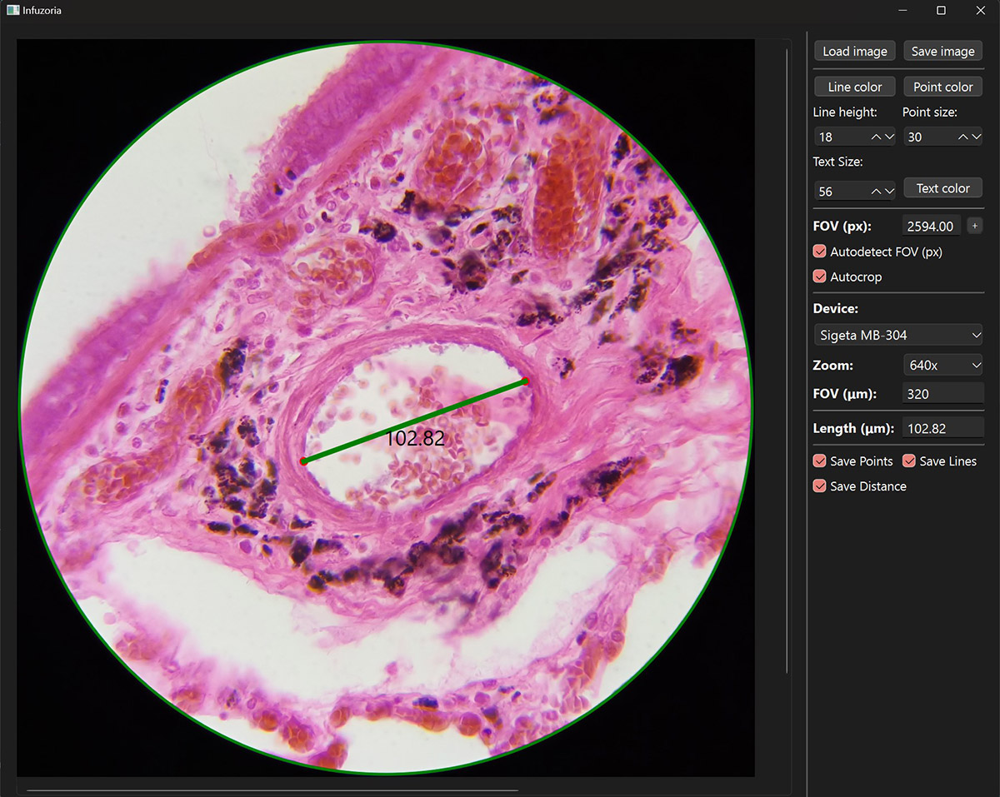
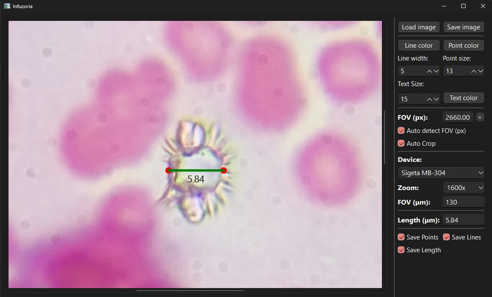
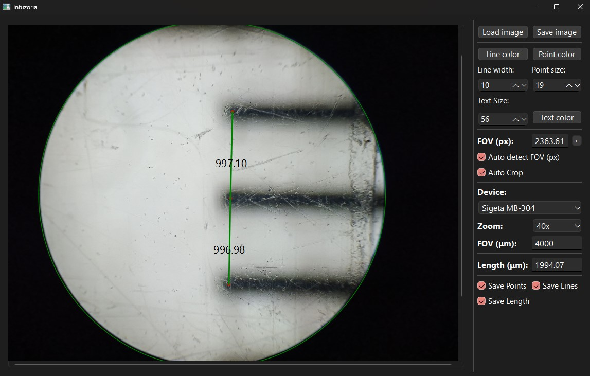

# Infuzoria

Infuzoria is an application that helps to work with images taken under a microscope. It allows measuring objects' size on the image by setting the FOV (field of view) value and drawing a line on the image.

I wrote this application for my own needs, but it may be helpful to someone else.

The application is written in Python using the PySide6 library for the graphical user interface and the OpenCV library for image processing.



## Features
- Open images in the following formats: JPG, PNG.
- Automatically detect the image's field of view (FOV) value.
- Auto-crop the image to remove the black borders.
- Measure the Length of objects in micrometers on the image by drawing a line on the image.
- Simple devices manager to store the FOV values for different microscopes.
- Retrieve the FOV value from the file name.
- Save the resulting image with the measured sizes.

## Installation

### Reade-to-use bundle

You can download the bundle created by `pyinstaller` from the [releases page](https://github.com/dmcooller/infuzoria/releases). The bundle contains the application and all the necessary libraries. You can run the application by double-clicking on the `Infuzoria.exe` file. For now, the bundle is available only for Windows.

### From source

To install the application, you must install Python 3.11 or 3.12 on your computer. You can download Python from the official website: https://www.python.org/downloads/.

Also, I used `poetry` to manage dependencies. You can download and install `poetry` from the official website: https://python-poetry.org/docs/#installation.

After installing Python and `poetry`, you can clone the repository and install the application using the following commands:

```bash
git clone https://github.com/dmcooller/infuzoria
```

```bash
cd infuzoria
```

Create a virtual environment:
```bash
python -m venv venv
```

For Windows:

```bash
.\venv\Scripts\activate
```

For Linux/MacOS:

```bash
source venv/bin/activate
```

Install the dependencies:
```bash
poetry install --no-dev
```

Run the application:
```bash
python .\src\app.py
```

## Usage

### Open and save images

To open an image, you should click on the `Load Image` button. The application supports the following image formats: JPG, PNG.

To save the resulting image, click the `Save Image` button.
You also can set the `Save Points`, `Save Lines`, and `Save Length` checkboxes to save the points, lines, and measurements on the resulting image.

You can use one trick in file naming to set the `Zoom` field automatically. If the file name contains the zoom level at the beginning or the end of the file name, the application will try to extract the zoom level from the file name. For example, the file name `40x_image.jpg` will set the `Zoom` field to `40`.

### FOV and Auto Crop

If the `Auto Detect FOV (px)` checkbox is checked, the application will try to detect the FOV value on the image.
Also, it will try to autocrop the image to remove the black borders if the `Auto Crop` checkbox is checked.

If the FOV value is not detected automatically or incorrectly, you can set it manually by pressing the `+` button placed after the FOV value in the `FOV (px)` field.
After pressing the button you should draw a line (diameter) on the image and the application will calculate the FOV value based on the line length. When you finished drawing the line, press `+` button again.
`Auto Crop` won't work if the FOV value is set manually.

### Manage Devices

You should create `devices.ini` file to keep the settings for your microscope. You can use an example file, `devices.ini.example` as a template.

The file should contain the following sections:

```ini
[Device1]
zooom_level1 = number
zooom_levelN = number
```

Where `Device1` is your microscope's name and `zooom_level1`, `zooom_levelN` are the zoom levels of your device. The value should be the FOV value in micrometers. You can find the FOV values in the microscope documentation or measure them manually.

After creating the file, you can use the `Devices` section to select the device and the zoom level.

### Measure the size of objects

Now, when you have the FOV value set, and at lest one device created, you can measure the size of objects on the image.
To do so, select the proper device and zoom level, draw a line on the image, and the application will calculate the object's size in micrometers. The more accurate the FOV value for the image and the device, the more precise the measurement will be.



You can adjust `Line width`, `Line color`, `Point size`, `Point color`, `Text size`, and `Text color` on the right side of the application window.

You can add as many lines as you need. The application will calculate the Length of each line separately and the total Length of all lines in the `Length (μm)` field. Separate object measurement is not supported yet.



### Shortcuts and Actions

- `Ctrl-Z` - Undo the last drawing. The last point, line, and Length will be removed.
- `Ctrl-U` - Redo the last undone drawing. The last point, line, and Length will be restored.
- `Ctrl-Mouse Wheel` - Zoom in/out of the image.
- `Space-Left Mouse Button` - Move the image.

A context menu is available on the image. You can use it to undo, redo, clear all drawings, and clear everything (including the image).